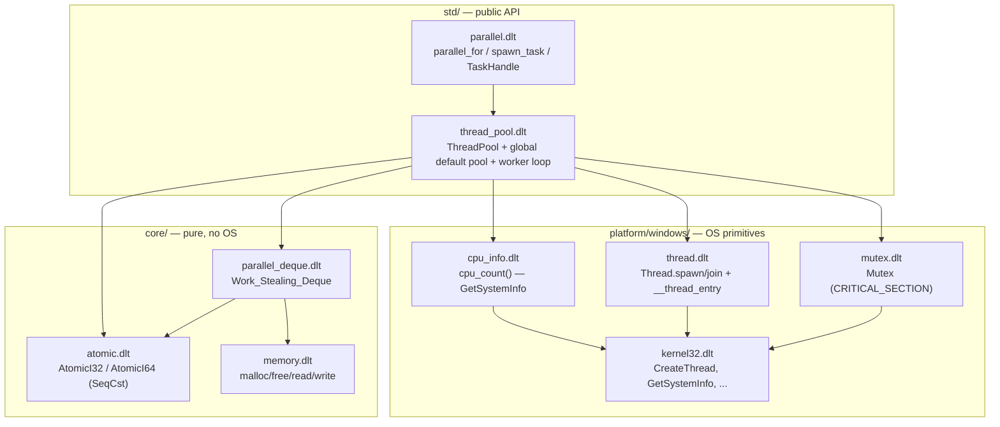
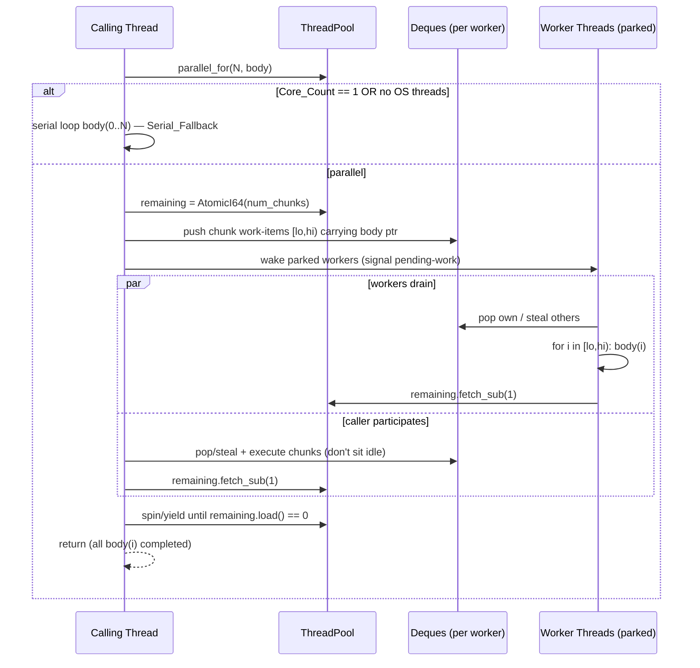

# Design Document — dolet-parallel

## Overview

هاد المستند بيوصف الـ design تبع `dolet-parallel`: نظام الـ CPU data-parallelism لـ standard library تبع Dolet. الفكرة المركزية إنه المطوّر بيكتب `parallel_for(count, body)` أو `spawn_task(work)` من غير ما يحدّد عدد الـ threads، والـ runtime بيقرأ عدد الـ logical cores وقت التشغيل (`Core_Count`) وبيوزّع الشغل لحاله. نفس الـ binary بيتأقلم من core واحد لعدد كبير من الـ cores، وعلى منصّة بلا OS threads بيشتغل بشكل serial صح.

الـ design مبني بالكامل فوق الـ primitives الموجودة فعلًا — ما في أي intrinsic جديد للـ compiler:
- `Thread.spawn(f: @heap fun())` / `join()` و الـ shim `__thread_entry(env: i64) -> i32` (في `library/platform/windows/thread.dlt`) — هاد بالضبط النمط اللي رح تعيد استخدامه worker threads تبع الـ pool.
- `@heap AtomicI32` / `@heap AtomicI64` مع `load/store/fetch_add/fetch_sub/swap/cas` (كلها SeqCst) من `library/core/atomic.dlt` — هدول الـ atomics الوحيدين المتوفرين، ومنهم بنبني الـ work-stealing deque.
- `@heap Mutex` (CRITICAL_SECTION) مع `lock/unlock/try_lock/with/destroy` من `library/std/mutex.dlt`.
- `Memory.malloc/malloc_zeroed/free/read_i64/write_i64/...` من `library/core/memory.dlt` و `library/platform/windows/alloc.dlt` للـ raw buffers.

الإضافة الوحيدة على مستوى الـ FFI هي ربط `GetSystemInfo` (أو `GetActiveProcessorCount`) في `kernel32.dlt` عشان نقرأ `Core_Count` (R12).

### مبدأ التصميم الحاكم: الصحّة قبل السرعة

هاد النظام concurrency حقيقي، وأصعب جزء فيه (الـ work-stealing و الـ park/wake) هو مصدر الـ bugs اللي بتطلع بس تحت الضغط. القرار الحاكم: **v1 بيختار أبسط آلية صحيحة، وأي تحسين أداء أسرع بينعمل documented كـ future work.** تحديدًا:
- الـ atomics SeqCst بس — هاد conservative بس صحيح. acquire/release optimization مؤجّل.
- الـ park/wake بيستخدم آلية مبنية على الموجود (Mutex + counter + يييلد/Sleep backoff) بدل ما نضيف FFI جديد لـ Win32 events. الـ events أسرع بس بيزيدوا سطح الخطأ — مؤجّلين.
- الـ work-stealing deque (R4 بيطلبه صراحة) بينعمل، بس الـ steal محمي بشكل conservative (SeqCst + mutex-assisted steal) بدل lock-free Chase-Lev الكامل.

### Requirement Coverage Map (R1..R12)

| Req | الموضوع | وين بينعالج في الـ design |
|---|---|---|
| R1 | Layered core/platform/std architecture | Architecture §، الملفات الجديدة |
| R2 | Runtime adaptation to Core_Count | Components: `cpu_count()`, `ThreadPool.new`/`new_with_workers` |
| R3 | Parallel_For semantics (exactly-once، blocking، serial fallback) | Components: `parallel_for`، Serial Fallback § |
| R4 | Work-stealing load balancing | Components: `Work_Stealing_Deque`، Concurrency Correctness § |
| R5 | Persistent pool lifecycle (init/park/wake/shutdown) | Components: `ThreadPool`، worker loop، Lifecycle § |
| R6 | Background task spawn/wait | Components: `spawn_task`, `TaskHandle` |
| R7 | Scheduler correctness & thread safety | Concurrency Correctness §، Correctness Properties § |
| R8 | Performance intent | Architecture (persistent pool)، Testing Strategy (perf note) |
| R9 | Real-machine verifiability | Testing Strategy §، Correctness Properties § |
| R10 | Engine integration (Engine.parallel_for + CPU culling) | Engine Integration § |
| R11 | Thread-crossing closure `@heap` safety | Closure/Thread ABI § |
| R12 | GetSystemInfo FFI binding | Components: `cpu_count()`، Data Models (SYSTEM_INFO)، Bootstrap § |

## Architecture

النظام بينقسم على طبقات Dolet التلاتة بنفس نمط `Thread`/`Mutex` الموجود. كل طبقة عندها مسؤولية واضحة، والـ `std/` ما بيلمس أي Win32 API مباشرة (R1.4).

### الملفات الجديدة بالضبط

**`core/` (خوارزميات نقية، بلا OS، بلا FFI — R1.1):**
- `library/core/parallel_deque.dlt` — `Work_Stealing_Deque`: ring buffer من `i64` work-item handles فوق `Memory` buffer، مع `top`/`bottom` indices كـ `AtomicI64`. كل المنطق هون بلا أي OS call.

**`platform/windows/` (الـ primitives الخاصة بالـ OS ورا interface موحّد — R1.2):**
- ربط `GetSystemInfo` + `GetActiveProcessorCount` يتضاف لـ `library/platform/windows/kernel32.dlt` (extern block موجود).
- `library/platform/windows/cpu_info.dlt` — `struct CpuInfo` مع `static fun cpu_count() -> i32` (الـ Cpu_Info_Provider). يقرأ من `GetActiveProcessorCount(ALL=0xFFFF)` مع fallback لـ `GetSystemInfo`.
- الـ Os_Thread_Primitive = الـ `Thread` الموجود (إعادة استخدام، مش ملف جديد).
- الـ Park_Wake_Primitive = آلية مبنية على `Mutex` + `AtomicI32` counters داخل `thread_pool.dlt` (مش FFI جديد في v1 — انظر Concurrency §).

**`std/` (الـ public API — R1.3):**
- `library/std/thread_pool.dlt` — `struct ThreadPool` + الـ global default pool + worker loop.
- `library/std/parallel.dlt` — `parallel_for(count, body)`, `spawn_task(work) -> TaskHandle`, `struct TaskHandle`.

**على platforms بلا OS threads (R1.6, R6.5, R3.5):** الـ `cpu_info.dlt` المقابل بيرجّع `Core_Count = 1`، والـ `ThreadPool` ما بيخلق workers، فالكل بيشتغل serial.

### تعديلات الـ mod.dlt (السطور بالضبط)

- `library/core/mod.dlt`: ضيف `load core/parallel_deque` بعد `load core/atomic` (لأنه بيعتمد على `AtomicI64`). و `export Work_Stealing_Deque`.
- `library/platform/windows/mod.dlt`: ضيف `load platform/windows/cpu_info` بعد `load platform/windows/info`. و `export GetSystemInfo`, `export GetActiveProcessorCount`, `export CpuInfo`.
- `library/std/mod.dlt`: ضيف `load std/thread_pool` و `load std/parallel` بعد `load platform/{platform}/mutex`. و `export ThreadPool`, `export TaskHandle`, `export parallel_for`, `export spawn_task`.

### مخطط الطبقات والاعتماديات



### مخطط تسلسل نداء parallel_for



النقطة المهمة في المخطط: الـ **calling thread بيشارك في تنفيذ الـ chunks** (بيسرق/بينفّذ) بدل ما يقعد blocked idle — هيك بنستغل كل الـ cores بما فيهم الـ caller، وبنتجنّب lost-wakeup deadlock (لو ما في workers أصلًا، الـ caller لحاله بيخلّص الشغل).

## Components and Interfaces

### 1. Cpu_Info_Provider — `platform/windows/cpu_info.dlt`

```dolet
struct CpuInfo:
    # Returns logical processor count at runtime. Always >= 1.
    # Tries GetActiveProcessorCount(ALL_GROUPS); falls back to
    # GetSystemInfo.dwNumberOfProcessors. On failure returns 1.
    static fun cpu_count() -> i32:
        n: i32 = GetActiveProcessorCount(65535)   # ALL_PROCESSOR_GROUPS = 0xFFFF
        if n >= 1:
            return n
        # Fallback: GetSystemInfo into a 48-byte SYSTEM_INFO buffer.
        buf: i64 = Memory.malloc_zeroed(48)
        GetSystemInfo(buf)
        cores: i32 = Memory.read_i32(buf + 32)    # dwNumberOfProcessors @ offset 32
        Memory.free(buf)
        if cores < 1:
            return 1
        return cores
```

FFI الجديد في `kernel32.dlt` (R12.1):
```dolet
extern lib "kernel32":
    fun GetSystemInfo(lpSystemInfo: i64)          # ptr to 48-byte SYSTEM_INFO
    fun GetActiveProcessorCount(GroupNumber: i32) -> i32
```

### 2. Work_Stealing_Deque — `core/parallel_deque.dlt`

ring buffer من `i64` handles. المالك بيـ `push`/`pop` من الـ bottom، السارقين بياخدوا من الـ top. الـ `top`/`bottom` كـ `AtomicI64`. تحت SeqCst بس، الـ steal محمي إضافيًا بـ CAS على `top` (conservative-correct؛ النسخة الـ lock-free الكاملة Chase-Lev acquire/release = future work).

```dolet
@heap
struct Work_Stealing_Deque:
    buffer:   i64        # Memory.malloc(capacity * 8) — i64 slots
    capacity: i64        # power of two (mask = capacity - 1)
    top:      AtomicI64  # steal end (incremented by thieves)
    bottom:   AtomicI64  # owner end (push/pop)

attach Work_Stealing_Deque:
    static fun new(capacity: i64) -> Work_Stealing_Deque: ...
    # Owner only. Store handle at bottom, bump bottom.
    fun push(self, item: i64): ...
    # Owner only. Returns -1 (EMPTY) if no item. Resolves the
    # last-item race against a thief via CAS on top.
    fun pop(self) -> i64: ...
    # Thief. Returns -1 (EMPTY) or -2 (ABORT/lost-race). CAS top.
    fun steal(self) -> i64: ...
    fun is_empty(self) -> bool: ...
    fun destroy(self): ...   # Memory.free(buffer) + free atomics' storage
```

`EMPTY = -1`، `ABORT = -2` — متفقين إن الـ work-item handles كلها `>= 0` (offsets في الـ work-item arena، أو indices). صفر valid handle.

### 3. ThreadPool — `std/thread_pool.dlt`

```dolet
@heap
struct ThreadPool:
    num_workers:  i32        # 0 means serial mode (Core_Count==1 or no threads)
    deques:       i64        # ptr to Work_Stealing_Deque[num_workers]
    threads:      i64        # ptr to Thread handles[num_workers] (i64 each)
    # Lifecycle / wakeup state — all atomic or mutex-guarded (R7.1):
    state:        AtomicI32  # 0=UNINIT, 1=RUNNING, 2=SHUTTING_DOWN
    shutdown:     AtomicI32  # 1 once shutdown requested; workers exit loop
    pending:      AtomicI64  # count of outstanding (un-drained) work items
    epoch:        AtomicI64  # bumped on each submit — lost-wakeup guard
    sleep_mtx:    Mutex      # guards the park decision (re-check pending)

attach ThreadPool:
    static fun new() -> ThreadPool:                      # workers = cpu_count()-derived
    static fun new_with_workers(n: i32) -> ThreadPool:   # explicit worker count (R2.3)
    fun submit_chunk(self, deque_idx: i32, item: i64):   # push to a worker's deque
    fun signal_work(self):                               # bump epoch, wake parked
    fun worker_count(self) -> i32:
    fun shutdown(self):                                  # idempotent (R5.5..8, R7.6)
```

`ThreadPool.new` derives workers من `cpu_count()`. لو `cpu_count() <= 1` (R2.4) أو OS threads مش متوفرة، `num_workers = 0` (serial mode) والـ pool بيظل "ناجح" بـ 0 workers (R3.4, serial fallback).

عدد الـ workers المقترح: `max(0, cpu_count() - 1)` لأن الـ calling thread بيشارك في الشغل — فمجموع المنفّذين = `cpu_count()`. (لو `cpu_count()==1` → 0 workers → الـ caller لحاله = serial.)

### 4. Worker thread entry & loop

كل worker بينخلق بنفس نمط `Thread.spawn`: closure `@heap fun()` بيلتقط الـ `pool` ptr و الـ `worker_index`، والـ `__thread_entry` الموجود بيستدعيه. ما في shim جديد.

```dolet
# داخل ThreadPool.new، بعد ما تنخلق الـ deques:
wi: i32 = 0
while wi < self.num_workers:
    pool_addr: i64 = self as i64
    idx: i32 = wi
    body: @heap fun() = fun() _pool_worker_loop(pool_addr, idx)
    t: Thread = Thread.spawn(body)
    Memory.write_i64(self.threads + (wi as i64) * 8, t.handle)
    wi = wi + 1

fun _pool_worker_loop(pool_addr: i64, worker_index: i32):
    pool: ThreadPool = pool_addr as ThreadPool
    while pool.shutdown.load() == 0:
        item: i64 = _pool_find_work(pool, worker_index)   # pop own, else steal
        if item >= 0:
            _pool_execute_item(item)                       # run the chunk
            pool.pending.fetch_sub(1)                      # R7.3 drain accounting
        else:
            _pool_park(pool)                               # park until epoch bumps
    # exit: shutdown observed
```

`_pool_find_work`: يجرّب `deques[worker_index].pop()`؛ لو EMPTY، يلف على باقي الـ deques و يجرّب `steal()` (R4.1). لو steal رجّع ABORT (lost race) يكمّل للتالي — هيك بنضمن "exactly one acquires" (R4.3).

### 5. parallel_for & spawn_task — `std/parallel.dlt`

```dolet
# R3, R11.1. body must be @heap fun(i32).
fun parallel_for(count: i32, body: @heap fun(i32)):
    if count <= 0:
        return                                            # R3.3
    pool: ThreadPool = _default_pool()
    if pool.worker_count() == 0:
        # Serial_Fallback — R3.4, R3.5
        i: i32 = 0
        while i < count:
            body(i)
            i = i + 1
        return
    # Partition [0,count) into chunks; pack each into a work-item record.
    # Distribute round-robin across worker deques. Track a 'remaining'
    # chunk counter the caller waits on.
    remaining: AtomicI64 = AtomicI64.new(num_chunks as i64)
    ... push chunks (each carries body ptr + [lo,hi) + remaining ptr) ...
    pool.signal_work()
    # Caller participates: steal+run chunks instead of idling.
    _pool_drain_until(pool, remaining)
    while remaining.load() > 0 as i64:
        Thread.yield_now()
    remaining.destroy()
    return                                                # R3.2 all done

# R6, R11.2. work must be @heap fun().
fun spawn_task(work: @heap fun()) -> TaskHandle:
    pool: ThreadPool = _default_pool()
    done: AtomicI32 = AtomicI32.new(0)
    if pool.worker_count() == 0:
        work()                                            # R6.5 run inline
        done.store(1)
        return TaskHandle(done=done)
    # Pack (work ptr, done ptr) into a task work-item, push, signal.
    ... push task item ...
    pool.signal_work()
    return TaskHandle(done=done)                          # R6.1
```

### 6. TaskHandle — `std/parallel.dlt`

```dolet
struct TaskHandle:
    done: AtomicI32        # 0 = pending, 1 = completed

attach TaskHandle:
    # Block until the task's worker sets done=1. If already done,
    # returns immediately (R6.4). While waiting, the caller also
    # helps drain the pool so a 1-worker pool can't deadlock (R7.7).
    fun wait(self):
        while self.done.load() == 0:
            if _default_pool_try_run_one() == 0:
                Thread.yield_now()
```

`TaskHandle` صغير (بس فيه `done` atomic) فبيظل stack-allocated.

## Data Models

### Work-item record (مغلّف في i64-addressable buffer)

الـ work items بتتخزّن في buffer مخصّص للـ submission (arena من `Memory.malloc`)، والـ deque بيخزّن **offset/handle** (`i64`) لكل record. تنين أنواع records:

**Range chunk (parallel_for):** 40 bytes
| Offset | Field | Type | معنى |
|---|---|---|---|
| 0 | kind | i64 | 0 = RANGE |
| 8 | body_ptr | i64 | الـ `@heap fun(i32)` closure env pointer |
| 16 | lo | i64 | بداية المدى (inclusive) |
| 24 | hi | i64 | نهاية المدى (exclusive) |
| 32 | remaining_ptr | i64 | الـ `AtomicI64` remaining counter للـ parallel_for |

**Task (spawn_task):** 24 bytes
| Offset | Field | Type | معنى |
|---|---|---|---|
| 0 | kind | i64 | 1 = TASK |
| 8 | work_ptr | i64 | الـ `@heap fun()` closure env pointer |
| 16 | done_ptr | i64 | الـ `AtomicI32` done flag للـ TaskHandle |

`_pool_execute_item(item)` بيقرأ `kind` من offset 0:
- RANGE: لكل `i` في `[lo,hi)` يستدعي الـ body. النداء `body(i)` على `@heap fun(i32)` بيمرّر `(env_ptr, i)` (closure ABI). بعد ما يخلص، `fetch_sub(1)` على `remaining`.
- TASK: يستدعي `work()` (يمرّر `(env_ptr)`)، بعدها `done.store(1)`.

### Deque ring buffer layout

`buffer = Memory.malloc(capacity * 8)`، `capacity` power-of-two، `mask = capacity - 1`. الـ slot `k` بيخزّن في `buffer + (k & mask) * 8`. الـ `top`/`bottom` بيكبروا monotonically (i64، ما بيـ wrap عمليًا)، والـ masking بيعمل الـ wrap على الـ physical buffer.

### ThreadPool state struct

موصوف فوق. كل field مشترك إما `Atomic*` أو محمي بـ `sleep_mtx` (R7.1). `deques` و `threads` arrays raw من `Memory.malloc`.

### SYSTEM_INFO layout (x64، 48 bytes) — للـ FFI (R12)

| Offset | Field | Type |
|---|---|---|
| 0 | wProcessorArchitecture | WORD |
| 2 | wReserved | WORD |
| 4 | dwPageSize | DWORD |
| 8 | lpMinimumApplicationAddress | LPVOID |
| 16 | lpMaximumApplicationAddress | LPVOID |
| 24 | dwActiveProcessorMask | DWORD_PTR |
| **32** | **dwNumberOfProcessors** | **DWORD** |
| 36 | dwProcessorType | DWORD |
| 40 | dwAllocationGranularity | DWORD |
| 44 | wProcessorLevel + wProcessorRevision | WORD + WORD |

`cpu_count()` بيقرأ `Memory.read_i32(buf + 32)`. `GetActiveProcessorCount(0xFFFF)` هو الأبسط (بيرجّع i32 مباشرة، بلا struct) فهو الـ primary path و GetSystemInfo الـ fallback.

## Concurrency-Correctness Design

هون منعالج كل بند من Requirement 7 صراحة، ومنشرح كيف بيتحقق تحت atomics SeqCst-only.

### R7.1 — Data-race freedom (كل field مشترك Atomic أو Mutex-guarded)

- الـ deque indices (`top`/`bottom`) → `AtomicI64`.
- الـ pool state (`state`, `shutdown`, `pending`, `epoch`) → atomics.
- قرار الـ park (الـ "check-then-sleep") → محمي بـ `sleep_mtx` (Mutex) عشان نتجنّب lost-wakeup.
- الـ `deques` و `threads` arrays بينكتبوا مرة وحدة وقت الـ `new` (قبل ما يطلع أي worker)، وبعدها read-only — ما في race.
- الـ work-item records: كل record بينكتب بالكامل من الـ submitting thread **قبل** ما الـ handle يتدفع على الـ deque (publish-after-init)، وما بينقرأ إلا بعد `pop`/`steal` ناجح. الـ atomic CAS على `top`/`bottom` بيعمل الـ happens-before تحت SeqCst.

### R7.3 + R3.1 — Exactly-once index processing

كل index بيكون ضمن chunk واحد بالضبط (المدى `[0,count)` بينقسم لـ chunks متباينة `[lo,hi)` بلا تداخل ولا فجوات). الـ chunk بينفّذه worker واحد بالضبط لأن:
- الـ owner `pop` و الـ thief `steal` متنافسين على نفس الـ handle بـ CAS على `top`؛ بس واحد بينجح (R4.3). الخاسر بياخد ABROT و بيكمّل.
- بمجرّد ما الـ handle بينسحب من الـ deque ما بيرجع ينحط.

فكل index بينفّذ مرة وحدة بالضبط — لا ضياع ولا تكرار.

### R7.4 — Exact-count invariant

لو كل index عمل `fetch_add(1)` على shared `AtomicI32`، وبما إن كل index بينفّذ exactly-once، المجموع النهائي = N بالضبط. `fetch_add` SeqCst atomic فما في lost updates (نفس ضمانة `tests/atomic_counter.dlt`).

### R7.7 — Termination / no-deadlock لأي Core_Count ≥ 1

الضمانات:
1. **الـ caller بيشارك في الـ draining** (`_pool_drain_until`) بدل ما يقعد blocked. فحتى لو كل الـ workers انشغلوا أو ما طلعوا، الـ caller لحاله بيخلّص كل الـ chunks. هاد بيضمن forward progress حتى عند `num_workers == 0`.
2. الـ wait loop بيستنى `remaining.load() == 0`؛ وبما إن مجموع الـ `fetch_sub(1)` = عدد الـ chunks، الـ counter حتمًا بيوصل صفر بعد ما تنفّذ كل الـ chunks.
3. ما في nested locks بترتيب معكوس — الـ `sleep_mtx` هو القفل الوحيد و بينمسك لفترة قصيرة جدًا (re-check + park decision) وما بينمسك أثناء تنفيذ الـ body.

### Lost-wakeup hazard (الخطر الأخطر) — كيف بنتجنّبه

السيناريو الخطير: worker بيشوف الـ deques فاضية → بيقرر ينام؛ بنفس اللحظة submitter بيدفع شغل و بيبعت wake؛ الـ wake بيضيع لأن الـ worker لسا ما نام فعليًا → الـ worker بينام للأبد و الشغل بيقعد.

الحل: **epoch/generation counter + double-check تحت الـ Mutex.**

```dolet
fun _pool_park(pool: ThreadPool):
    pool.sleep_mtx.lock()
    seen_epoch: i64 = pool.epoch.load()
    # Re-check for work AFTER recording the epoch, under the lock.
    if pool.pending.load() > 0 as i64 or pool.shutdown.load() == 1:
        pool.sleep_mtx.unlock()
        return                          # work appeared — don't park
    pool.sleep_mtx.unlock()
    # Bounded backoff park: spin/yield, wake if epoch changed or work arrived.
    spins: i32 = 0
    while pool.shutdown.load() == 0:
        if pool.epoch.load() != seen_epoch:
            return                      # a submit bumped epoch — wake
        if pool.pending.load() > 0 as i64:
            return
        if spins < 64:
            Thread.yield_now()
            spins = spins + 1
        else:
            Thread.sleep(1)             # ms — deepest backoff level

fun ThreadPool.signal_work(self):
    self.pending.fetch_add(num_pushed as i64)   # publish work count
    self.epoch.fetch_add(1)                       # bump generation -> wakes parkers
```

ليش هاد صحيح: الـ submitter بيرفع `pending` و `epoch` **بعد** ما يدفع الـ work على الـ deque. الـ parker بيسجّل `seen_epoch` ثم بيـ double-check `pending` تحت الـ lock؛ لو الشغل إجا قبل ما يسجّل، بيشوفه و ما بينام. لو إجا بعد ما سجّل، الـ `epoch` رح يكون اختلف عن `seen_epoch` فبيصحى. ما في نافذة بيضيع فيها الـ wake. (هاد polling-with-backoff؛ صحيح ومنخفض الخطر. استبداله بـ Win32 `CreateEvent`/`SetEvent`/`WaitForSingleObject` = future work لتقليل الـ latency و الـ idle CPU.)

> ملاحظة أداء: الـ backoff بيوصل لـ `Sleep(1)` لما يطول الخمول، فالـ idle CPU بيظل منخفض. هاد مقبول لـ v1. الـ event-based wake (latency أقل، صفر spin) = documented future work.

### R5.5..R5.8 + R7.5/R7.6 — Idempotent init/shutdown

- **Init idempotence:** الـ global default pool محمي بـ `state` atomic؛ الـ first-use بيعمل CAS `UNINIT(0) -> RUNNING(1)`؛ بس اللي ينجح بالـ CAS بيخلق الـ workers، الباقيين بيستنوا لحد ما `state == RUNNING`. تكرار الـ init بيشوف `state == RUNNING` و بيرجع بلا تغيير (R5.7, R7.5).
- **Shutdown idempotence:** `shutdown()` بيعمل CAS `RUNNING(1) -> SHUTTING_DOWN(2)`؛ بس اللي ينجح بيـ set `shutdown=1`، يصحّي كل الـ workers (epoch bump)، يعمل `join` لكلهم، و يحرّر الـ deques و الـ thread handles (R5.5, R5.6). نداء تاني بيشوف الـ state مش RUNNING و بيرجع بلا error (R5.8, R7.6).

## Serial Fallback (R2.4, R3.4, R3.5, R6.5)

السلوك بالضبط لما `cpu_count() == 1` أو OS threads مش متوفرة (`num_workers == 0`):
- `ThreadPool.new` بينجح، بيرجّع pool بـ `num_workers = 0`، بلا ما يخلق ولا thread ولا deque (أو deques فاضية).
- `parallel_for(count, body)` → loop عادي: `i` من 0 لـ count، `body(i)` على نفس الـ calling thread. النتيجة مطابقة تمامًا للـ parallel path لأي Pure_Mapping (R3.6, R7.2).
- `spawn_task(work)` → بينفّذ `work()` inline فورًا على الـ calling thread، بعدها بيرجّع `TaskHandle` بـ `done=1`، فـ `wait()` بيرجع فورًا (R6.5).
- `shutdown()` بيرجع بلا ما يعمل join لأي thread (ما في).

الـ platform بلا OS threads بيوفّر `cpu_count()` بيرجّع 1 (R1.6) فنفس الـ serial path بيشتغل بلا أي فرع خاص في الـ std layer.

## Closure / Thread ABI (R11)

الـ closures اللي بتعبر حدود الـ threads لازم تكون `@heap` (R11.1, R11.2). الـ design بيعيد استخدام نفس آلية `Thread.spawn`/`__thread_entry` بالضبط:

- **القيمة هي الـ env pointer:** الـ `@heap fun(i32)` (Body_Closure) و `@heap fun()` (Task_Closure) قيمتهم = pointer للـ env اللي على الـ heap؛ `env[0]` فيه الـ fn_ptr.
- **التمرير للـ worker:** الـ submitter بيخزّن `body as i64` (أو `work as i64`) في الـ work-item record (offset 8). هاد raw pointer، فالـ env بيظل valid عبر حدود الـ thread طالما الـ closure `@heap` (R11.3).
- **الاستدعاء داخل الـ worker:** الـ worker بيقرأ الـ pointer، بيعمله cast: `b: @heap fun(i32) = body_ptr as @heap fun(i32)` ثم `b(i)`. الـ codegen بيلوّر هاد لـ: load fn_ptr من `env[0]` و call `fn_ptr(env_ptr, i)` — بالضبط زي `__thread_entry` بس مع argument زيادة `i`. للـ Task: `w: @heap fun() = work_ptr as @heap fun(); w()` → `fn_ptr(env_ptr)`.

ما في shim جديد و لا تغيير على الـ compiler — الـ closure-call lowering الموجود بيغطي `fun(i32)` تمامًا زي `fun()`.

> سبب الـ `@heap` الإجباري: لو الـ closure stack-allocated، الـ env بيـ dangle بمجرّد ما الـ frame اللي خلقه يرجع — use-after-free على الـ worker. نفس قاعدة `Thread.spawn`. الـ API بيفرض النوع `@heap fun(...)` في الـ signature فالـ compiler بيرفض غيره وقت compile.

## Global Default Pool (R5.1, R10.1)

في pool واحد على مستوى الـ process بيستخدمه كل من `std` `parallel_for`/`spawn_task` و `Engine.parallel_for` — ما منخلق pool لكل نداء (R5.2).

```dolet
# std/thread_pool.dlt
g_default_pool_ptr: i64 = 0          # 0 = not yet created
g_default_pool_state: AtomicI32 = AtomicI32.new(0)   # 0=UNINIT 1=RUNNING

fun _default_pool() -> ThreadPool:
    # Lazy first-use init, guarded by CAS so only one thread builds it.
    if g_default_pool_state.cas(0, 1):
        p: ThreadPool = ThreadPool.new()
        g_default_pool_ptr = p as i64
        return p
    # Another thread is/has initialized — wait until ptr is published.
    while g_default_pool_ptr == 0:
        Thread.yield_now()
    return g_default_pool_ptr as ThreadPool
```

استراتيجية الـ init: **lazy first-use** (أبسط و بيتجنّب الاعتماد على ترتيب الـ global init). ملاحظة: الـ compiler صار يشغّل non-constant global initializers قبل user `main` عبر `@__dolet_global_init`، فالـ eager global (`g_pool: ThreadPool = ThreadPool.new()`) كمان بيشتغل صح؛ بس اخترنا الـ lazy لأنه ما بيدفع تكلفة الـ pool لو البرنامج ما استخدم parallelism أبدًا. الـ shutdown للـ default pool اختياري (بيتحرّر عند خروج الـ process)؛ منوفّر `parallel_shutdown()` صريح للـ leak tests (R9.3).

## Engine Integration (R10)

### Engine.parallel_for — wrapper رفيع

في `packages/frog` (مثلًا `frog/core/engine.dlt`) بينضاف:
```dolet
fun engine_parallel_for(count: i32, body: @heap fun(i32)):
    parallel_for(count, body)        # delegate to std — no re-implementation (R10.1)
```
ما في scheduler تاني في الـ engine — بس delegation (R10.1).

### Parallelizing CPU Frustum Culling — Pure_Mapping

الكود الحالي (في `packages/frog/render/gpu_renderer_core.dlt`) بيمشي على الـ instances serially و بيستدعي `_frog_instance_visible(vp, model, bx,by,bz,br)` لكل instance، و النتيجة بتأثّر على إيش بينرسم (الكود بيقرأ `vb_visible[gi]` و bounds لكل `gi`).

الخطة: نعزل خطوة حساب الـ visibility لكل instance في pre-pass متوازي بيكتب على array منفصل `vb_cull_result` (i32 لكل instance، 1/0)، **كل worker بيكتب بس على slot الـ index تبعه** — Pure_Mapping بلا shared write race (R10.2, R7.2):

```dolet
# pre-pass (parallel): compute visibility per instance into vb_cull_result.
vp_addr: i64 = vp_mat
cnt: i32 = self.vb_count
res: i64 = self.vb_cull_result        # i32[vb_count], one slot per instance
self_addr: i64 = self as i64
body: @heap fun(i32) = fun(gi: i32) _frog_cull_one(self_addr, vp_addr, gi, res)
engine_parallel_for(cnt, body)
# main pass (serial, unchanged): reads vb_cull_result[gi] instead of
# calling _frog_instance_visible inline.
```

`_frog_cull_one(self_addr, vp, gi, res)` بيقرأ bounds الـ instance `gi`، بيستدعي `_frog_instance_visible`، و بيكتب النتيجة على `Memory.write_i32(res + gi*4, v)` — بس على slot `gi` تبعه. ما في كتابة مشتركة بين الـ workers، فالـ visible set بيطلع مطابق تمامًا للـ serial (R10.2). على platform بلا threads، `parallel_for` بيشتغل serial و بينتج نفس الـ set (R10.3).

ملاحظة: `_frog_instance_visible` بيقرأ بس من `vp` و `model`/bounds (read-only inputs) و بيرجّع i32 — هو pure فعلًا، فآمن للتوازي. الـ main render pass بيظل serial و بيقرأ النتيجة المحسوبة مسبقًا.

## Error Handling

النظام ما بيـ crash أبدًا تحت فشل الـ environment — بيتدهور بأمان (graceful degradation):

| الفشل | التصرّف |
|---|---|
| `GetActiveProcessorCount` رجّع 0 و `GetSystemInfo` فشل | `cpu_count()` بيرجّع 1 → serial mode (R2.4) |
| `cpu_count()` < 1 (أي قيمة غير منطقية) | تُعامل كـ 1 (R2.4) |
| `CreateThread` فشل لـ worker (handle == 0) | الـ pool بيعدّ بس الـ workers اللي نجحوا؛ لو نجح صفر → `num_workers=0` → serial. ما في crash. |
| `Memory.malloc` للـ deque/buffer رجّع 0 | الـ pool بيتراجع لـ serial mode (workers=0) بدل ما يكتب على null |
| `parallel_for` count == 0 أو سالب | يرجع فورًا بلا استدعاء (R3.3) |
| shutdown مكرّر، أو init مكرّر | idempotent، بلا error (R5.7, R5.8) |

ما منستخدم `panic` في الـ scheduler core — الفشل دايمًا بيتحوّل لـ degraded-but-correct (serial). هاد بيخدم متطلب الـ baremetal/no-thread (R1.6) و الـ robustness (R7).

## Testing Strategy

نهج مزدوج: **property-based tests** للقواعد الكونية + **unit tests** للأمثلة و الحالات الحدّية و الـ integration. كل property بينفّذها **اختبار property-based واحد**، بأقل تقدير 100 iteration، و بـ tag بيرجع للـ property في هاد المستند.

بما إن Dolet ما عنده PBT library جاهزة، الـ "property test" بينعمل كـ deterministic randomized stress harness: مولّد بسيط (LCG seed ثابت لإعادة الإنتاج، زي `Random` في `core/random`) بيولّد inputs عشوائية، و الـ test بيدوّر >= 100 iteration و بيتحقّق من الـ property كل مرة، بيـ fail بأول counterexample. الاختبارات بتنحط في `tests/` و بتشتغل عبر `run_tests.bat` (R9.4).

### Property tests (مربوطة بالـ properties تحت)

- **Exact-count stress (Property 4 ← R7.4, R9.1):** generator: random `N` (1..200000) و random worker-count cap عبر `new_with_workers`. لكل iteration: `parallel_for(N, fun(i) counter.fetch_add(1))`؛ assert `counter.load() == N`.
- **Parallel == serial Pure_Mapping (Property 5 ← R7.2, R3.6, R9.2):** generator: random `N`، random pure function `f(i)` (مثلًا `i*i + seed`)، random per-index cost (busy-loop بطول عشوائي لاختبار load imbalance R4.4). املأ `out_parallel` عبر `parallel_for` و `out_serial` عبر loop؛ assert تطابق كل العناصر.
- **Exactly-once coverage (Property 3 ← R7.3, R3.1):** generator: random `N`. `parallel_for(N, fun(i) hits[i].fetch_add(1))` على array من atomics؛ assert كل `hits[i] == 1` (لا ضياع ولا تكرار).
- **Init/shutdown leak-freedom (Property 6 ← R5.6, R7.6, R9.3):** generator: random cycle-count (1..100). كل دورة: `ThreadPool.new()` ثم استخدام بسيط ثم `shutdown()`. قبل و بعد، اقرأ `Memory.alloc_balance()`؛ assert إنه رجع لنفس القيمة (لا تسريب memory)، و إن كل thread انعمله join.
- **Deadlock-freedom across core counts (Property 7 ← R7.7):** generator: random worker-count من 0 لـ (cpu_count()*2)، random `N`. شغّل `parallel_for` و تأكّد إنه بيرجع (الـ harness بيفشل لو ما رجع خلال timeout watchdog).
- **Empty range (Property — edge ← R3.3):** `parallel_for(0, body)` لازم ما يستدعي body ولا مرة و يرجع.

### Unit tests (أمثلة و edge cases و integration)

- `spawn_task` + `wait`: مهمة بتزيد global، بعد `wait` القيمة محدّثة (R6.1..R6.4).
- `wait` على مهمة خلصت قبل: يرجع فورًا (R6.4).
- serial fallback: `new_with_workers(0)` ثم `parallel_for(N, ...)` يشتغل و ينتج صح (R3.4).
- `cpu_count()` يرجّع `>= 1` على الجهاز (R2.1, R12.2).
- idempotent double-init / double-shutdown ما بيـ crash (R5.7, R5.8).
- Engine: مشهد ثابت، قارن الـ visible set من `engine_parallel_for` culling pre-pass مع الـ serial — لازم يكونوا متطابقين (R10.2).
- Perf smoke (R8، informational مش assertion صارمة): embarrassingly-parallel workload متوازي مقابل serial، اطبع الزمنين — متوقّع المتوازي أسرع على multi-core.

### Property test config

- أقل من 100 iteration لكل property test.
- كل اختبار عنده watchdog/timeout عشان deadlock يصير fail واضح مش hang.
- seed ثابت لإعادة إنتاج الـ counterexample.
- Tag format في تعليق فوق كل اختبار: `# Feature: dolet-parallel, Property N: <property text>`.

## Bootstrap / Build Note (R12.3)

الـ `GetSystemInfo` / `GetActiveProcessorCount` FFI بينضاف لـ `kernel32.dlt`، اللي هو ملف **library يُحمّل ضمن الـ runtime**. السؤال المهم: هل لازم نعمل bootstrap كامل؟

- **الـ compiler نفسه (`pipeline_build.dlt` sources) ما بيستهلك** `GetSystemInfo` ولا الـ thread pool — الـ compiler ما بيعمل parallel_for لحاله في v1. فإضافة الـ FFI binding **ما بتأثّر على الـ self-hosted compiler build**.
- يعني: ما في حاجة لـ 2-step bootstrap dance (§19) إلا لو لاحقًا الـ compiler sources استخدموا النظام. حاليًا **يكفي إعادة بناء برامج الـ user/الـ engine و الـ tests** اللي بتستورد `std`.
- بس: متطلب R12.3 بيقول الـ binding لازم "يبني عبر الـ 3-stage byte-stable bootstrap عبر `build.bat`". هاد متحقّق تلقائيًا لأن `build.bat` بيعيد بناء كل الـ stdlib (بما فيه `kernel32.dlt`) ضمن الـ pipeline؛ بما إن الإضافة بس `extern` declarations جديدة بصياغة موجودة (ما في keyword جديد)، الـ stage 1→2→3 بيظل byte-stable من غير الحاجة لـ two-step feature dance.

الخلاصة الدقيقة: شغّل `build.bat` مرة وحدة للتأكد إن الـ bootstrap byte-stable مع الـ FFI الجديد، ثم `run_tests.bat` لـ 94 + اختبارات `dolet-parallel` الجديدة (R9.4). ما في keyword/ABI جديد فما في two-step dance.

## Correctness Properties

*الـ property هي خاصية أو سلوك لازم يضل صحيح عبر كل التنفيذات الصحيحة للنظام — تصريح رسمي عن إيش المفروض النظام يعمله. الـ properties هي الجسر بين الـ specifications المقروءة من البشر و ضمانات الصحّة القابلة للتحقّق آليًا.*

بعد تحليل الـ prework لكل acceptance criterion و دمج المتكرر (مثلًا 3.1 و 7.3 نفس الخاصية؛ 3.6 و 7.2 و 3.4 و 3.5 و 4.4 كلها نفس خاصية تطابق المتوازي مع الـ serial؛ خصائص الـ deque المتزامن 4.2/4.3 مغطّاة بالـ exactly-once على مستوى الـ pool)، هدول الـ properties المتباينة النهائية. الـ criteria المعمارية (R1، R10.1، R11.1/11.2)، و الـ performance (R8)، و البناء (R12.1/12.3, R9.4) مش properties قابلة للتنفيذ الآلي.

### Property 1: Exactly-once index coverage

*For any* integer `N > 0` and any Body_Closure, after `parallel_for(N, body)` returns, every index `i` in the range `[0, N)` has been invoked exactly once — no index is skipped and none is invoked more than once (regardless of worker count or scheduling, including under concurrent steals on the same work item).

**Validates: Requirements 3.1, 7.3, 4.2, 4.3, 2.5**

### Property 2: Parallel equals serial for a pure mapping

*For any* integer `N >= 0`, any Pure_Mapping `f`, any per-index cost distribution, and any worker count from 0 up to twice the Core_Count, the output array produced by `parallel_for(N, fun(i) out[i] = f(i))` is element-for-element equal to the output produced by a serial loop over the same range and `f`.

**Validates: Requirements 3.6, 7.2, 3.4, 3.5, 4.4, 9.2**

### Property 3: Exact-count invariant (with completion before return)

*For any* integer `N >= 0` and any worker count, if every index performs exactly one `fetch_add(1)` on a shared `AtomicI32` counter (initialized to 0) inside `parallel_for(N, body)`, then immediately after `parallel_for` returns the counter equals `N` — which also establishes that all body invocations completed before the call returned.

**Validates: Requirements 7.4, 3.2, 9.1**

### Property 4: Empty range invokes the body zero times

*For any* count `c <= 0`, calling `parallel_for(c, body)` invokes the Body_Closure zero times and returns.

**Validates: Requirements 3.3**

### Property 5: Explicit worker count is honored

*For any* requested worker count `n >= 0` (bounded by available resources), a pool created via `ThreadPool.new_with_workers(n)` reports `worker_count() == n` (and `n == 0` yields a valid serial-mode pool).

**Validates: Requirements 2.3**

### Property 6: Each spawned task runs exactly once

*For any* collection of `k` Task_Closures submitted via `spawn_task`, after every returned Task_Handle's `wait()` completes, each task has executed exactly once.

**Validates: Requirements 6.2**

### Property 7: Init idempotence

*For any* sequence of Pool_Lifecycle initialization calls with no intervening shutdown, the resulting pool behaves identically to a single initialization — the same set of Worker_Threads stays unchanged and no additional threads are created.

**Validates: Requirements 5.7, 7.5**

### Property 8: Shutdown idempotence

*For any* number of consecutive shutdown calls on a pool, the observable result is identical to a single shutdown and every call after the first returns without error.

**Validates: Requirements 5.8, 7.6**

### Property 9: Init/shutdown cycles are leak-free and fully joined

*For any* number of repeated `ThreadPool.new()` → use → `shutdown()` cycles, the net allocation balance (`Memory.alloc_balance()`) returns to its pre-cycle baseline and every Worker_Thread is joined before each shutdown returns — no thread or memory leak accumulates across cycles.

**Validates: Requirements 5.6, 5.5, 9.3**

### Property 10: Termination without deadlock for any core count

*For any* Core_Count (worker count) from 0 upward and any `N >= 0`, a `parallel_for(N, body)` call terminates (returns) within a bounded time while workers are stealing and the pool is draining — it never deadlocks.

**Validates: Requirements 7.7**

### Property 11: Engine parallel culling produces the same visible set

*For any* scene and camera, the visible set computed by Cpu_Frustum_Culling through `Engine.parallel_for` is identical to the visible set computed by the existing serial Cpu_Frustum_Culling — independent of Core_Count and including the no-OS-threads serial-fallback case.

**Validates: Requirements 10.2, 10.3**
