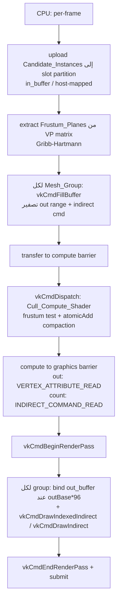
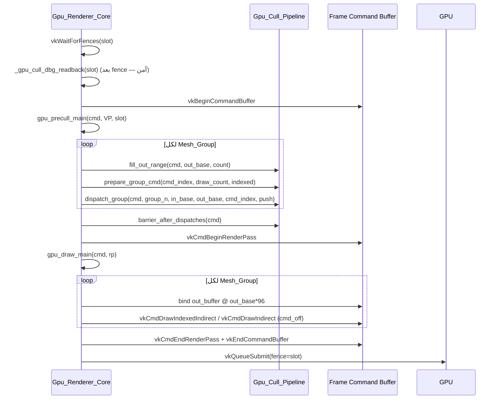

# Design Document: GPU-Driven Culling

## Overview

هاي الوثيقة بتوصّف التصميم النهائي لمسار الـ unified GPU-driven culling + draw بمحرك Frog. الهدف: مسار رسم واحد بيشتغل بالكامل على الـ GPU (compute cull + indirect draw)، صحيح ومستقر بصريًا (بدون flicker للأجسام المتحركة)، مطابق بصريًا لمسار الـ CPU، قابل للقياس عبر stress scene، وقابل للتوسّع نحو Hi-Z occlusion culling لاحقًا.

النواة الحالية شغّالة جزئيًا: الـ frustum culling على الـ GPU مثبت (self_test 2/2، وعلى المشهد الحقيقي `visible=38` ثابت). المشكلة المتبقية هي **flicker للأجسام المتحركة** لما يكون مسار الرسم الـ GPU-driven مفعّل. هالتصميم بيعالج السبب الجذري ويحدّد المعمارية النهائية.

### Requirement coverage map

| Requirement | بيتغطّى بـ |
|---|---|
| R1 — Unified GPU-driven draw path | Architecture, Components |
| R2 — Moving-object flicker correctness | Root-Cause Analysis And Fix |
| R3 — Visual parity with CPU path | Visual Parity Strategy |
| R4 — GPU frustum culling correctness | Architecture (cull stage), Correctness Properties |
| R5 — Frame synchronization and buffering | Architecture (slot model), Fix (barriers) |
| R6 — Performance validation via stress scene | Stress-Scene Plan |
| R7 — Vulkan feature/device constraints | Data Models, Fix (firstInstance=0) |
| R8 — Correctness verifiability | Testing Strategy (self_test, counters) |
| R9 — Round-trip / invariant properties | Correctness Properties, Testing Strategy |
| R10 — Extensibility toward occlusion | Extensibility Hook |
| R11 — Scope boundary for shadow pass | Scope Boundary |

## Architecture

المسار الـ GPU-driven بيشتغل كله جوا الـ command buffer تبع الـ frame نفسه — مفيش `vkQueueWaitIdle` بالمسار الدوري. التسلسل: تسجيل الـ cull dispatches (compute) قبل ما يبلّش الـ render pass، بعدها barrier، بعدها الـ indirect draws جوا الـ render pass.

### Data-flow diagram

### Per-frame command-buffer sequence

### Buffer layout

كل الـ buffers مقسومة لـ `FROG_CULL_SLOTS = 2` partitions (slot لكل frame-in-flight)، فالـ frame N بيكتب بس على partition تبعه.

| Buffer | Stride | الحجم الكلي | usage flags | الوصف |
|---|---|---|---|---|
| `in_buffer` (candidates) | 112B (`FROG_CULL_INSTANCE_STRIDE`) | `slot_cap * 112 * 2` | STORAGE (0x20) | host-mapped؛ الـ CPU بيرفع الـ Candidate_Instances كل frame |
| `out_buffer` (compacted) | 96B (`FROG_CULL_OUT_STRIDE`) | `slot_cap * 96 * 2` | STORAGE\|VERTEX (160) | الـ compute بيكتبه storage، الـ draw بيقراه instance vertex buffer |
| `count_buffer` (indirect cmds) | 20B/group | `FROG_CULL_MAX_GROUPS * 20 * 2` | INDIRECT\|STORAGE (288) | host-mapped؛ array من VkDrawIndexedIndirectCommand |

- `slot_in_base(slot) = slot * slot_cap` — أول instance index للـ slot.
- `slot_cmd_base(slot) = slot * FROG_CULL_MAX_GROUPS` — أول command index للـ slot.

### Descriptor setup

descriptor set واحد، 3 storage-buffer bindings (binding 0 = in، 1 = out، 2 = count)، كلها COMPUTE stage. push-constant range واحد بطول `FROG_CULL_PUSH_SIZE = 112` (COMPUTE).

### Slot / frame-in-flight model

`max_frames == FROG_CULL_SLOTS == 2`. الـ `slot = current_frame`. الـ fence تبع الـ slot بيضمن إنه frame N-2 خلص قبل ما نعيد استخدام نفس الـ partition. هاد invariant أساسي — التصميم بيفرضه ويتأكد منه.

## Components and Interfaces

### GpuCullPipeline (`packages/frog/render/gpu_culling.dlt`)

- `init(device, phys_device) -> i32` — descriptor layout + compute pipeline + pool.
- `ensure_capacity(count) -> i32` — يكبّر الـ buffers (per-slot budget × 2 slots).
- `slot_in_base(slot) / slot_cmd_base(slot) / slot_capacity()` — حساب حدود الـ partition.
- `prepare_group_cmd(g, count, indexed)` — تعبئة indirect command (firstInstance=0).
- `dispatch_group(cmd, candidate_count, in_base, out_base, cmd_index, push)` — bind + push + dispatch.
- `barrier_after_dispatches(cmd)` — compute→graphics barrier.
- `group_visible_count(g) -> i32` — قراءة instanceCount (للتشخيص + الاختبار).
- `write_full_instance(idx, inst_ptr, cx, cy, cz, radius)` — رفع candidate.
- **جديد:** `fill_out_range(cmd, out_base, count)` — `vkCmdFillBuffer` لتصفير شريحة الـ out_buffer.
- `self_test(cmd_pool, gfx_queue)` — تحقق إقلاعي (4 instances → 2 visible).
- `frog_cull_extract_planes(vp, out)` — استخراج الـ 6 planes (Gribb/Hartmann).

### GpuRendererCore (`packages/frog/render/gpu_renderer_core.dlt`)

- `set_gpu_culling(enabled, cull_ptr)` / `set_gpu_draw(enabled)` — toggles.
- `gpu_precull_main(cmd, vp_mat, slot) -> i32` — يسجّل الـ cull dispatches بالـ frame cmd buffer.
- `gpu_draw_main(cmd, rp)` — يصدر الـ indirect draws جوا الـ render pass.
- `_cull_upload_instance(cull, dst_idx, gi, g_model)` — pack + upload candidate.
- `_grp_tex(arr, i)` — قراءة texture id (للـ grouping).
- `_gpu_cull_dbg_readback(slot)` — تشخيص (بعد fence wait).

### Runtime wiring (`packages/frog/core/runtime.dlt`)

ينشئ `GpuCullPipeline`, يشغّل `self_test`, ويفعّل `set_gpu_culling(1)` + `set_gpu_draw(1)`. فشل الـ init بيرجّع لمسار الـ CPU تلقائيًا.

ملاحظة: `gpu_tex_end_oneshot` بيعمل `vkQueueWaitIdle` — مستخدم بس بالـ self_test / harness، **مش** بالمسار الدوري.

## Data Models

### Candidate_Instance — 112B (`FROG_CULL_INSTANCE_STRIDE`)

| offset | حقل |
|---|---|
| 0..63 | model matrix (4 × vec4، column-major) |
| 64..79 | material params (vec4) |
| 80..95 | uv transform (vec4) |
| 96..111 | bounds sphere (center.xyz, radius) |

### Output_Instance — 96B (`FROG_GPU_INSTANCE_STRIDE`)

نفس أول 96 بايت من الـ Candidate (model + material + uv) — بدون الـ bounds. مطابق لـ instance vertex layout اللي الـ pipeline متوقّعه (`FROG_GPU_INSTANCE_MATERIAL_OFFSET=64`, `FROG_GPU_INSTANCE_UV_OFFSET=80`).

### Indirect_Command

- Indexed (20B): `{indexCount, instanceCount, firstIndex, vertexOffset, firstInstance}` — `vkCmdDrawIndexedIndirect` stride 20.
- Non-indexed (16B): `{vertexCount, instanceCount, firstVertex, firstInstance}` — `vkCmdDrawIndirect` stride 16، بيستخدم أول 16 بايت من نفس الـ 20B slot.
- **`instanceCount` بـ offset +4 بالاثنين** — فالـ atomicAdd بالـ shader بيشتغل بنفس الـ offset للنوعين.
- `firstInstance = 0` دايمًا (drawIndirectFirstInstance غير مفعّلة).

### Push-constant block — 112B (`FROG_CULL_PUSH_SIZE`)

| offset | حقل |
|---|---|
| 0..95 | 6 × frustum plane (vec4) |
| 96 | candidateCount (u32) |
| 100 | inBase (u32) |
| 104 | outBase (u32) |
| 108 | cmdIndex (u32) |

### Tracking arrays (GpuRendererCore)

- `gpu_grp_mi / gpu_grp_outbase / gpu_grp_count / gpu_grp_indexed / gpu_grp_cmd` — i32[] لكل group بالـ frame الحالي (بتتكتب بالـ precull وتنقرا بالـ draw، نفس الـ command buffer).
- `gpu_slot_grpn / gpu_slot_cmdbase / gpu_slot_runs` — i32[FROG_CULL_SLOTS] للتشخيص.

## Root-Cause Analysis And Fix (الـ flicker — القسم الأساسي)

### الأعراض

- self_test 2/2 ✓. على المشهد الحقيقي `groups=70 candidates=70 visible=38` **ثابت** كل frame (مقروء بعد fence wait).
- الأجسام الثابتة بترندر صح. **بس** الأجسام المتحركة (السيارة + مكعب متحرك) بترمش بسرعة كبيرة.
- `slot_runs[0] == slot_runs[1]` — الـ double-buffering شغّال.

### الفرضيات المرفوضة (مع الأدلة)

1. **الـ barrier masks غلط؟** — لأ. `barrier_after_dispatches` بستخدم src=SHADER_WRITE (0x40), dst=VERTEX_ATTRIBUTE_READ|INDIRECT_COMMAND_READ (0xA), srcStage=COMPUTE (0x800), dstStage=DRAW_INDIRECT|VERTEX_INPUT (0x6). هاي صحيحة للـ compute→{vertex,indirect} read بنفس الـ command buffer.
2. **race على الـ slots / fence؟** — لأ. `max_frames == FROG_CULL_SLOTS == 2`، والـ `slot = current_frame`، والـ fence بيضمن انتهاء frame N-2. مؤكّد بـ `slot_runs` المتساوية.
3. **بيانات قديمة بالـ input؟** — لأ. `_cull_upload_instance` بيرفع كل الـ candidates (بما فيها model matrix المحدّثة) كل frame للـ slot الحالي.
4. **off-by-one بين precull و draw؟** — لأ. الاثنين بنفس الـ frame command buffer، والـ `gpu_grp_*` بتتكتب وتنقرا بنفس الإطار.

### السبب الجذري الحقيقي

**الـ `out_buffer` ما بنعمله clear بين الـ frames، والـ atomicAdd compaction غير حتمي.**

- منطقة الـ output تبعت كل group متباعدة حسب **candidate-count** (`out_base = group_in_base`)، مش حسب الـ visible-count. يعني لو group عنده 70 candidate و38 visible، الـ 38 بنكتبوا بأول 38 slot، والباقي (39..70) بيظل فيه **بقايا (stale records) من frames سابقة**.
- الـ `atomicAdd(cmds[cmdIndex].instanceCount, 1u)` بيحدّد الـ slot حسب ترتيب وصول الـ invocations — وهاد **غير حتمي** بين الـ frames (ترتيب الـ wave scheduling بتغيّر).
- للأجسام **الثابتة**: محتوى كل السجلات متطابق بايت-بايت، فإعادة الترتيب + البقايا غير مرئية → ما بترمش.
- للأجسام **المتحركة**: محتوى السجل بتغيّر كل frame. السجل بنزل بـ slot مختلف كل frame، وممكن يتلاقى مع بقايا قديمة أو يترك مكانه القديم فيه نسخة قديمة من نفسه — اللي بظهر ككرمشة.

هاد بطابق العَرَض تمامًا: `visible=38` ثابت (الـ count صح)، بس **مواقع** السجلات المضغوطة بتتنقّل عشوائيًا، فالأجسام المتحركة بترمش والثابتة لأ.

### الحل المختار (بدقة)

1. **تصفير out range قبل الـ dispatch:** لكل group بـ `gpu_precull_main`، نفّذ `vkCmdFillBuffer` على شريحة الـ out_buffer (offset = `out_base*96`, size = `group_n*96`) + على الـ slot's indirect-command range، بعدها `VkBufferMemoryBarrier` transfer→compute (src=TRANSFER_WRITE 0x1000, dst=SHADER_READ|SHADER_WRITE 0x60; srcStage=TRANSFER 0x1000, dstStage=COMPUTE 0x800). helper جديد `fill_out_range(cmd, out_base, count)` بالـ GpuCullPipeline.
2. **تقوية الـ compute→graphics barrier:** بدّل الـ global MEMORY_BARRIER بـ `VkBufferMemoryBarrier`-ات صريحة: out_buffer (SHADER_WRITE→VERTEX_ATTRIBUTE_READ 0x8)، count_buffer (SHADER_WRITE→INDIRECT_COMMAND_READ 0x2)، srcStage=COMPUTE, dstStage=DRAW_INDIRECT|VERTEX_INPUT.
3. **فرض invariant** `max_frames == FROG_CULL_SLOTS == 2` بالـ init/precull (تحذير + fallback آمن لو اختلفوا).
4. **Fallback (موثّق، اختياري):** لو ضل flicker بعد 1+2، استبدل الـ atomicAdd ordering بـ **deterministic per-candidate slot** بالـ cull.comp — كل candidate بيكتب على `outBase + local` (مكان ثابت)، مع pass تانية أو prefix-count لتعبئة الـ instanceCount. هاد بيشيل اللاحتمية كليًا بس بكلفة compaction أكثف.
5. **firstInstance = 0** دايمًا مع bind للـ instance vertex buffer عند `out_base*96` (مش معتمدين على drawIndirectFirstInstance).

> ملاحظة: الحل 4 (deterministic compaction) بيلغي اللاحتمية من جذرها، بس الحل 1 (clear) لحاله المفروض يكفي لأنه بيشيل البقايا اللي هي مصدر الكرمشة. منبلّش بـ 1+2 ونقيس قبل ما نلجأ لـ 4.

## Visual Parity Strategy

عشان الـ GPU path يطلع مطابق بصريًا للـ CPU path:

- **نفس grouping keys:** `gpu_precull_main` بيجمّع حسب vb handle + ib handle + index count + كل texture ids (tex/emissive/normal/metallic-roughness/occlusion عبر `_grp_tex`) — نفس مفاتيح الـ CPU draw loop.
- **نفس الـ packing:** `_cull_upload_instance` بيكتب material params + uv transform + shadow-receive bit بنفس الـ offsets (`FROG_GPU_INSTANCE_MATERIAL_OFFSET=64`, `FROG_GPU_INSTANCE_UV_OFFSET=80`) ونفس الـ `+65536.0` للـ shadow bit متل الـ CPU.
- **نفس الـ Cull_Margin:** `cull.comp` بستخدم `radius * maxScale * 2.25 + 2.0` مطابق لـ `_frog_instance_visible` بالـ CPU.
- **fallback toggle:** `set_gpu_draw(0/1)` للمقارنة المباشرة على نفس المشهد.

## Indexed vs Non-Indexed Handling

- `gpu_precull_main` بيحدّد `indexed = (ib_handle != 0 && ic > 0)`.
- indexed: `prepare_group_cmd(cmd_index, ic, 1)` + `gpu_draw_main` بيعمل `vkCmdDrawIndexedIndirect(cmd, ind_buf, cmd_off, 1, 20)` بعد bind الـ index buffer.
- non-indexed: `prepare_group_cmd(cmd_index, vc, 0)` + `vkCmdDrawIndirect(cmd, ind_buf, cmd_off, 1, 16)`.
- الـ `instanceCount` بـ offset +4 بالنوعين، فالـ compute shader واحد بيخدم الاثنين.

## Stress-Scene Plan

- مشهد فيه عشرات الآلاف من نفس الـ Mesh_Group instances (instancing حقيقي) — مش زي مشهد الـ collision-demo (82 mesh مختلفة، instance واحد لكل وحدة).
- قياس: شغّل مرة مع `set_gpu_draw(0)` (CPU) ومرة مع `set_gpu_draw(1)` (GPU)، اقرأ `[frog.pacing]` (avg_ms) + `[frog.render]` (draws/instances) + `[frog.cull]` (visible).
- النتيجة المتوقّعة: على هالمشهد، الـ GPU path بيكسب بفرق كبير بالـ ms/frame لأنه الـ CPU culling التسلسلي بيصير bottleneck بآلاف الـ instances.

## Error Handling

- فشل `cull.init` → طباعة `[frog.cull] FAILED` + رجوع تلقائي لمسار الـ CPU (الـ toggles ما بتتفعّل).
- `ensure_capacity`: لو الـ per-frame budget تعدّى الـ slot_cap، بيكبّر الـ buffers (capacity-doubling) قبل تسجيل أي dispatch.
- bounds guards: `in_cursor` ما بيتعدّى `slot_cap`, و `grp` ما بيتعدّى `FROG_CULL_MAX_GROUPS`.

## Extensibility Hook (Hi-Z Occlusion Culling)

- الـ occlusion test بينحط **بعد** الـ frustum test بنفس الـ compute stage (`cull.comp`)، قبل الـ `if (visible)` compaction.
- بيعيد استخدام نفس الـ Candidate_Instance / Output_Instance / Indirect_Command layout — مفيش تغيير بالـ I/O format.
- بيتطلّب مستقبلًا: depth pyramid (Hi-Z) كـ sampled image + binding إضافي، وفحص bounding sphere ضد الـ Hi-Z. التصميم بيخلّي القرار بـ compute stage واحدة عشان التوسعة تكون نقطة إدراج واحدة.

## Scope Boundary

- الـ GPU-driven culling بينطبق **بس** على الـ main pass.
- الـ shadow pass بيظل CPU-culled (`_frog_shadow_instance_visible`) — مش ضمن نطاق هالـ spec.
- لما الـ GPU path يكون مفعّل للـ main pass، سلوك الـ shadow pass ما بتغيّر.

## Correctness Properties

| # | Property | الوصف | Validates |
|---|---|---|---|
| P1 | Instance record round-trip | الـ Output_Instance المقروء (model+material+uv) = حقول الـ Candidate المرفوع لنفس الـ visible instance | R9.1, R2.3 |
| P2 | Visible-count invariant | مجموع per-group visible counts = عدد الـ candidates اللي عبروا الـ frustum | R9.2, R4.3 |
| P3 | Cull idempotence | نفس VP + نفس candidates مرتين → نفس مجموعة الـ visible | R9.3, R4.4 |
| P4 | Visible ≤ candidate bound | visible count ≤ عدد الـ candidates لكل group | R9.4 |
| P5 | Within-partition write | كل Output_Instance بينكتب جوا حدود partition تبع الـ group/slot | R2.5, R5.1 |
| P6 | Frustum correctness | الـ instance خارج أي plane بأكثر من الـ margin → مستبعد؛ داخل/متقاطع → مضمّن مرة وحدة | R4.1, R4.2 |
| P7 | firstInstance = 0 | كل indirect command عنده firstInstance=0، والـ bind بـ offset | R7.1, R7.2, R2.4 |
| P8 | Grouping keys match CPU | نفس مفاتيح الـ grouping متل الـ CPU path | R1.6, R3.2 |
| P9 | Cull-margin equality | margin الـ GPU = margin الـ CPU | R3.4 |
| P10 | Capacity growth | لو الـ budget تعدّى السعة، بتكبر قبل الـ dispatch | R1.3, R5.4 |

## Testing Strategy

### Dual approach

1. **On-screen verification:** المطوّر بيشغّل collision-demo ويراقب — الأجسام الثابتة والمتحركة بترندر صح بدون flicker، ومقارنة `set_gpu_draw(0/1)`.
2. **Host-side readback harness:** على نمط `self_test` / `gpu_cull_verify` — يرفع candidate set معروف، يعمل dispatch عبر one-shot command buffer (`gpu_tex_begin_oneshot`/`gpu_tex_end_oneshot` مع wait idle)، ويقرا الـ out_buffer + الـ indirect instanceCounts عشان يتحقق من الـ properties.

### Property-based testing

- **Generators:** random transforms (translate/rotate/scale)، random positions داخل/خارج الـ frustum، random group partitions (أحجام مجموعات مختلفة)، random candidate counts.
- **Properties to assert:** P1 (round-trip)، P2 (count invariant)، P3 (idempotence)، P4 (bound). كل property بتنفّذ على ~100 iteration مع عيّنات عشوائية.

### Property → test mapping

| Property | Test (harness) |
|---|---|
| P1 round-trip | upload N candidates، cull، اقرا out، قارن model/material/uv للـ visible |
| P2 invariant | احسب الـ CPU-side frustum pass count، قارن مع مجموع `group_visible_count` |
| P3 idempotence | cull مرتين بنفس VP+candidates، قارن مجموعتين الـ visible |
| P4 bound | تأكد `group_visible_count(g) <= candidate_count(g)` لكل group |

### Unit / example tests

- `self_test`: 4 instances، 2 داخل → visible=2 (إقلاعي).
- example مشهد ثابت: `visible` count ثابت عبر frames متتالية (P3 على مستوى المشهد).
